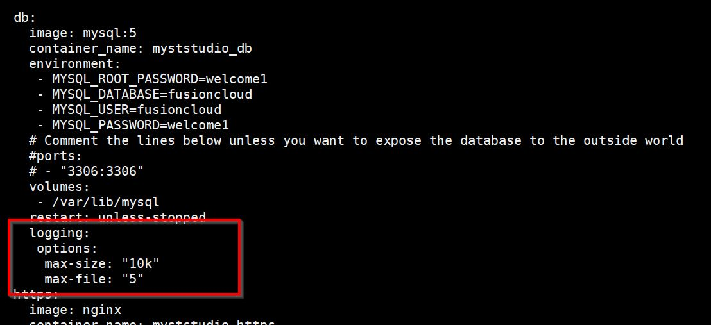

Consider the following options for performance and capacity management of Myst.

### Linux Entropy (random/urandom)

The OS may be running out of entropy. See the Oracle Support article below for more information. Changing from `/dev/random` to `/dev/./urandom` not only significantly improves OFMW but will improve Myst SSH connectivity time as Myst also relies on Java.
* [How to Diagnose a Linux Entropy Issue on WebLogic Server Instances](https://support.oracle.com/epmos/faces/DocumentDisplay?id=1574979.1)

### Platform Instance Action Checker
Myst Studio creates a background thread for every platform instance. When each thread executes it consumes seconds of CPU time to check for new actions against its platform instance.

As the the number of platform instances increase the threads will begin to overlap each other resulting in constant high CPU usage.

Use the `fc.quiet_period_sec.platform_instance` to reduce the platform instances' background check intervals. The default is `15` seconds.

The value can be roughly formulated to `<number_of_platform_instances> X 2`. For example, for 60 platform instances try experimenting with **120** (seconds).

1. Edit the `fc-configuration.properties`. 
   ```bash
docker exec -ti myststudio_web bash
vi /usr/local/tomcat/conf/fusioncloud/fc-configuration.properties
   ```
2. Update as required.
   ```properties
fc.host.address=XXXXXXXXX
fc.quiet_period_sec.platform_instance=120
fc.port=XXXX
   ```
3. Restart the container.
   ```bash
docker restart myststudio_web
   ```

## Tuning Memory parameters

Memory parameters can also be tuned to improve the performance. In order to tune the memory, you can apply the following parameters in the ***docker-compose.yml*** file and restarting Myst for the values to take effect. 

```yaml
    environment:
      CATALINA_OPTS: "-Xmx3072m -Xms3072m"
```

## Improving Log Rotation to Reduce Disk Usage

Add log rotation in the `docker-compose.yml` file to reduce disk usage. This can be added to any of the *services* inside the file.

1. Edit the `docker-compose.yml`

   ```bash
   cd /opt/myst-studio/conf
   vi docker-compose.yml
   ```
2. Set the values suitable as per your environment.
   ```yaml
    logging:
      options:
        max-size: "10M"
        max-file: "5"
   ```
   
2. Restart Myst which will recreate the **web** container with the new changes
   ```bash
cd  /opt/myst-studio/bin
./restart.sh
   ```

## Packet Size Breach / Support Artifact failure

### Diagnosis

Running a Myst action returns an error in the log.
```
019-04-15 12:52:50,555 [d9-faa98740671a] ERROR c.r.f.p.c.p.s.InvokeMyST       - Error
java.lang.Exception: Error occurred in the remote agent
2019-04-15 12:52:50,885 [d9-faa98740671a] ERROR o.h.e.j.s.SqlExceptionHelper   -Packet for query is too large (25134636 > 4194304). You can change this value on the server by setting the max_allowed_packet' variable.
```

### Cause

A support zip can be supplied to the Myst support team to help diagnose issues. The zip is generated when a Myst Studio action fails.

Sometimes the zip fails to upload to the Myst Studio database due to packet size restrictions. This happens when the zip is larger than the default 2mb possibly due to artifacts being in the zip as well.

### Resolution

Packet size `max_allowed_packet_size` can be altered in the 'db' docker service to increase the size. This is defined `docker-compose.yml`. 
*NOTE: Be cautious of setting this size too large as it will affect the java heap space usage.*

1. Backup your Myst Studio database
   ```bash
cd  /opt/myst-studio/bin
./backup-database.sh
   ```
2. Add the line below to increase the `max_allowed_packet` to `32M` to the **db** `docker-compose.yml`
   
3. Restart Myst which will recreate the **db** container with the new `max_allowed_packet` changes
   ```bash
cd  /opt/myst-studio/bin
./restart.sh
   ```

*NOTE: The value/size of the **max_allowed_packet** can be set (to any value), based on one's requirement*

## Raise a Myst Support Ticket

Feel free to raise a [support ticket](https://support.mystsoftware.com) if there are other suggestions you would like to make or requests you would like make.
