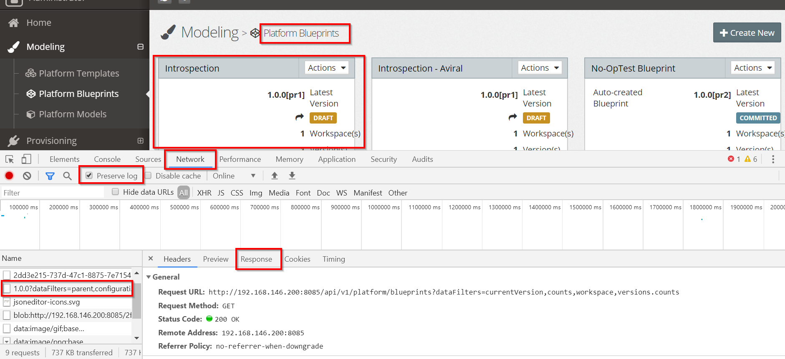

There are many different ways to compare Platform Blueprint or Platform Model configuration. Use any of the options below.

## Using Source Code

*Note: This functionality is available for MyST 6.0.0+*

1. Navigate to Platform Model -> Actions -> Configuration and change the tab to **Source View.**
2. Select the **View** drop-down and change it to **Code.**
   
3. Navigate to Actions -> View Commit History and get the JSON payload for the pm versions you want to compare.
   

*TIP: Use a compare tool to help here.*

## Using MyST properties Action

MyST 'properties' action gives you a complete report of all the properties, parameters and configurations of a Platform Model.

1. In the model, navigate to **Actions > Control**
   
2. Select the action as 'Custom', and enter '**properties**' as the custom name, and execute the action.
   
3. The output will display a `key=pair` formatted properties which can be used as a comparison

## Using the Report View

1. Navigate to **Actions > View Report** to view the generated report of the model.
   
2. You can also compare the below properties from the **View Report**
   

## Using Payload from the REST API

Similar to the source code view, the REST APIs can also be used to compare the Blueprints in MyST.

*NOTE: This example uses the Chrome web browser*

1. Login to MyST Studio and press F12.
2. Navigate to **Network** and enable the **Preserve log**  by checking the box.
3. Navigate to your desired Blueprint and browse to its configuration.
   You'll now see that a **log** with a name 'data' is being generated. Click on it to view the source code.
4. After you click on the data **log**, navigate to **Response** tab to view the source code of the Blueprint.
   
5. Click on **Response** tab
   
6. Retrieve the code and use compare tools to compare your Blueprints.

## Using Command Line

Another way of comparing the Blueprints is by retrieving the Platform Blueprint source code from the CLI.

MyST Studio is built on top of a set of REST APIs meaning any operations performed by the UI can also be automated using the REST APIs. You need to retrieve your API Key, set your environments, to get the Blueprint list and their IDs.

In this example, we are showing how to update a Platform Blueprint using the REST API. At a minimum you will require `curl` to be installed on your machine. To make JSON manipulation easier, it is also recommended to install `jq` which is downloadable from [here](https://stedolan.github.io/jq/download/).

#### Retrieving your API key:

In order to interact with API, you will first need to retrieve and/or regenerate an API key from MyST Studio. This can be performed as follows:  

1. Login to MyST Studio with an administrator account  
2. Click on **Administration** then select **Users**
3. Under the MyST Administrator \(API User\) click on drop-down and select **Show API Key**  
     
4. Copy the key, we will use this later in our MyST workspace. If you want, you can generate a new key at any time.  
   

#### Setting up your environment

The below `curl` examples will assume the following are set as environment variables

```
MYST_TOKEN=<your api key>
MYST_HOST=<your MyST host>
BLUEPRINT_ID=<your blueprint id>
BLUEPRINT_VERSION=<your blueprint version>
```

*NOTE: The `BLUEPRINT_ID` and `BLUEPRINT_VERSION` can easily be found in your browser URL when selecting the Platform Blueprint.*

#### Getting a list of available Blueprints

`curl -k -X GET -H "Authorization: Bearer $MYST_TOKEN"  "https://$MYST_HOST/api/v1/platform/blueprints"`

To pretty print the JSON result, you should consider piping that to `jq` as follows:
`curl -k -X GET -H "Authorization: Bearer $MYST_TOKEN"  "https://$MYST_HOST/api/v1/platform/blueprints" | jq`

#### Getting the ID of a specific Platform Blueprint

The `id` of a given Blueprint can be discovered within the listing of Platform Blueprints at `.data.id`. For instance, in the snippet below the `id` of `SOA Blueprint` is `c2a9a9c6-4dd6-44b4-8b7a-54a14a235802`.

```
{
  "data": [
    {
      "id": "c2a9a9c6-4dd6-44b4-8b7a-54a14a235802",
      "name": "SOA Blueprint",
      ...
```

If you want to programmatically find the id for `SOA Blueprint` you could execute the following with `curl` and `jq`

```
ID=$(curl -k -X GET -H "Authorization: Bearer $MYST_TOKEN"  "https://$MYST_HOST/api/v1/platform/blueprints" | jq --arg NAME "SOA Blueprint" -r ".data[] | select(.name == \$NAME) | .id")
```

Now you can execute `echo $ID` and it will output the Blueprint ID. For example:

`c2a9a9c6-4dd6-44b4-8b7a-54a14a235802`

#### Download the source file for a given Platform Blueprint:

In the previous step, we should how to get the identifier for a platform blueprint and set that to an environment variable called `ID`.

Now, we are going to download that source to a file called `blueprint.json` for `1.0.0` of our platform blueprint.

```
curl -k -X GET -H "Authorization: Bearer $MYST_TOKEN"  "https://$MYST_HOST/api/v1/platform/blueprints/$ID/versions/1.0.0?suppressComputed=true&dataFilters=*" > blueprint.json
```

*Note: If you're blueprint is on a different version to 1.0.0, make sure you change that in your query.*

If you wish to retrieve a specific revision of a platform blueprint version, you can add %5B**pr23**%5D to the URL as shown below. This will retrieve revision 23 of the platform blueprint version 1.0.0.

*Note: When accessing a specific revision of  a platform blueprint version, the curl url needs to use `http` with the appropriate port instead of using `https`*

```
curl -X GET -H "Authorization: Bearer $MYST_TOKEN"  "http://$MYST_HOST:8085/api/v1/platform/blueprints/$ID/versions/1.0.0%5Bpr23%5D?suppressComputed=true&dataFilters=*" > blueprint.json
```

### Download the source file for a given Platform Model

The steps to retrieve the platform model source are the same as those for the platform blueprint. Simply change the URL to use `models` instead of `blueprints`, and update the version and revision numbers to their appropriate value e.g. `1.0.0-1`and `%5Bpm23%5D`

```
curl -X GET -H "Authorization: Bearer $MYST_TOKEN"  "http://$MYST_HOST:8085/api/v1/platform/models/$ID/versions/1.0.0-1%5Bpm23%5D?suppressComputed=true&dataFilters=parent,configuration,revisionNumber" > model.json
```

Use compare tools to find the difference between different versions of the Platform Models and Platform Blueprints.
