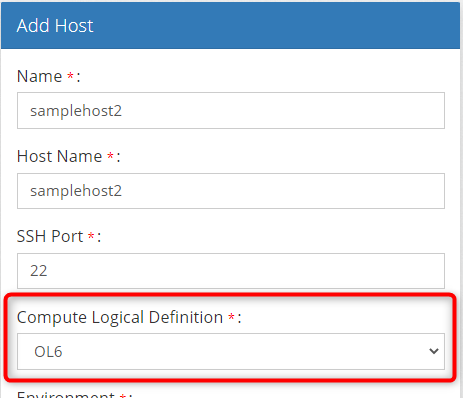
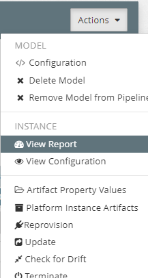
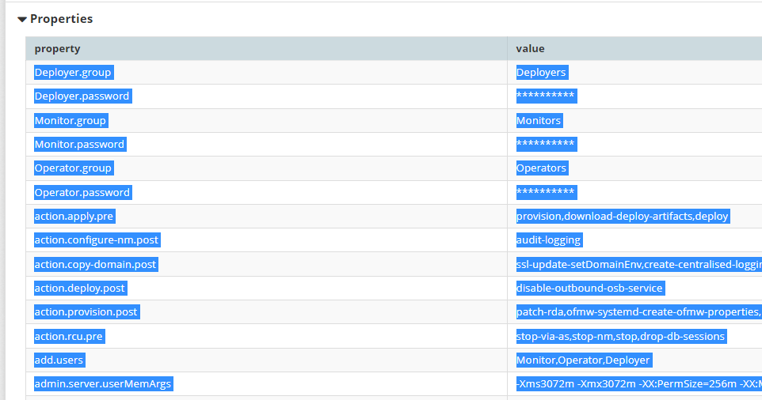
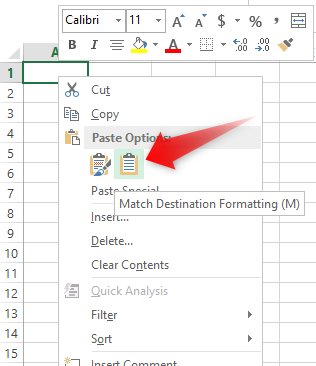
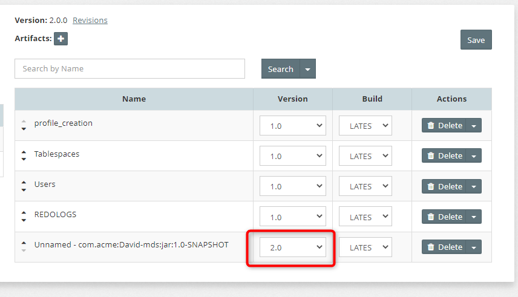
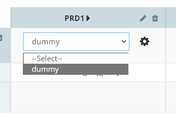

This guide covers the basics of creating a new Platform Blueprint and Platform Model based off an existing one.

# Use Case
The use case is the user wants to create a parallel Oracle FMW domain because an Oracle Database 19c upgrade is required resulting in another upgrade of FMW 12.2.1.4.0.


# Infrastructure Provider
1. Go to Infrastructure > **Infrastructure Providers**
2. Create the necessary provider and/or hosts. For example, if you are:
	1. **Reusing existing infrastructure** then no action is required.
	2. **Using new infrastructure** then select your provider (or create a new provider) and create new hosts<br><br>
**IMPORTANT**
1. There is a known bug with Compute Logical Definition where only OL6 should be selected. If any other option is selected you will not see the hosts when creating a new Platform Model.
2. There is no impact to selecting OL6. This option is only for visual purposes and features based off this were not yet implemented in Myst.<br> 


# Platform Blueprint
### Creating a new Blueprint from a Template
1. Go to **Platform Blueprints** and click your blueprint
2. Click Actions > **Save as Template** <br> 
3. Fill in the new template information

### Updating the Template
1. Go to **Platform Templates** and click your template
2. Here you can update your template as required. For example, you can update:
	1. Middleware Settings > Catalog Version
	2. Middleware Settings > Home Directory
	3. WebLogic Domain Configuration > Name
3. *(OPTIONAL)* To permanently disable editing on the template you can click Actions > **Publish** <br> 


### Create a Blueprint
1. Go to Platform Templates > Actions > **Generate Blueprint** <br> 
2. Fill in the new blueprint information and click **Next** and **Finish**
3. You are taken directly to the blueprint where you can **Save & Commit** the initial revision
4. You are now ready to create a model from the blueprint


# Platform Model
### Create a Model
1. Click Platform Model > 
2. Select the **platform blueprint** created earlier
3. Fill in the new model information and click  until you finally reach the  button
4. Verify your model and edit as required and 

### Editing & Comparisons Tips
Due to the nature of 'environment specific' Platform Models, the clone feature in Myst does not yet exist. If your goal is to create a like-for-like model then here are some tips to compare the Myst properties.

1. Click **Platform Model** and select your model
2. Click Actions > **View Report** <br>
3. Scroll down to **Properties** section
4. Highlight and copy the **property(s)/value(s)** into your clipboard <br>
5. Paste into a tool such as Microsoft Excel <br>
6. In Excel go to **Save As** and select **CSV** type <br>
7. Repeat for the other environment you want to compare
8. Finally, use a comparison tool to compare the two files <br>
9. Fix accordingly.
10. Update all passwords as required, especially if they were environment specific credentials.

**NOTE:** The Platform Blueprint was cloned so in theory most of the changes should be within the Platform Model.

### Rest API Tip
If you have experience with Rest APIs then you can use that to post/put/get/etc via the [Myst REST API](https://help.mystsoftware.com/?q=rest+api). We have found a tool such as [Postman](https://www.postman.com/) is quite helpful.


# Release Pipeline
### Updating Application Source Code
In upgrade use cases you may find OSB servers only allow deployments of applications built on the same version (eg. `12.2.1.4.0`). Here is a guide to maintaining two application versions
**a.** An application version for the old environment
**b.** An application version for the new environment

1. Build your new application source code as usual but in the pom.xml use a different major version (eg. `2.0`)
   ```xml
    <groupId>com.acme</groupId>
    <artifactId>Stock-mds</artifactId>
    <version>2.0-SNAPSHOT</version>
   ```
3. Use your previous version (eg. `1.0`) for your old environment's source code.
4. In the next section we handle versioning via the **Application Blueprint**


### Create the Application Blueprint
1. Go to Release Management > **Application Blueprints**
2. Select an existing **Application Blueprint** that is deployed to your environment
3. Click the drop down and click **Clone** and enter a new version (eg. `2.0.0`) <br>
4. For the newly built application(s) source code, select the new version <br>
5. Click 


### Create the Release Pipeline
1. Go to Release Management > **Pipelines**
2. Click 
3. Fill in and create the [Release Pipeline information (stream/stages/etc) as per the standard process.](https://userguide.mystsoftware.com/release/pipeline/)
4. When adding a Stream, make sure to select the **Platform Blueprint** created earlier <br>
5. Select the **Application Blueprints** which are similar to the release pipeline you are cloning <br>
6. Click 
7. Select the **Platform Model** for each **Stage** <br>
8. Click  then return to the pipline and click 


### Defaulting Artifact Property Registry
It's good practice to define the Stream Model defaults in the Artifact Property Registry. This will **significantly** reduce the effort of filling in the Stream Model properties for your new Platform Model.


### Updating Stream Model Properties
Here we update the Stream Model Properties for each new stage (environment). In Myst you can use the 'Edit Bulk' button and copy+paste from the existing stream model to the new stream model.

1. Go to Release Management > **Release Pipelines** and select the old pipeline
2. Click the **cog** icon and click **Open Stream Model** <br>
3. Click  button
4. **Highlight** all the property and values by dragging your mouse. The highlighted area becomes blue. <br>
5. Copy the contents to the clipboard (CTRL+C)
6. Go to your new release pipeline and open the **Stream Model**
7. Click the first column/row and paste the clipboard (CTRL+V) <br>
8. Scroll down and click 
9. Your Release Pipeline should be ready to go assuming you have provisioned the environment.

