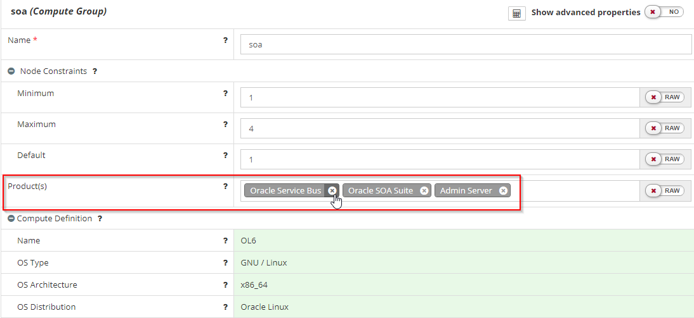
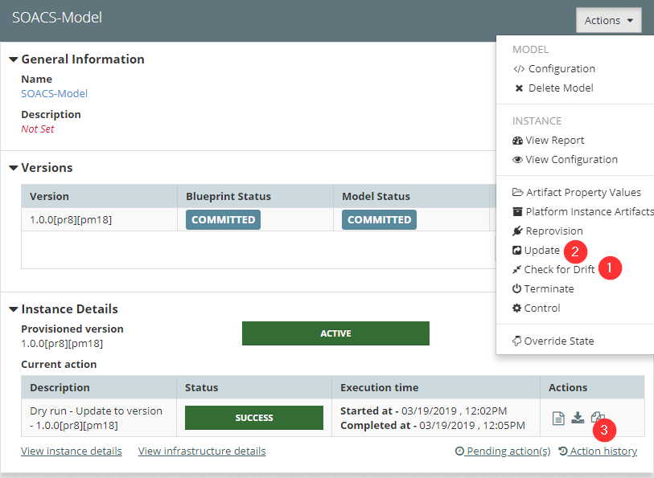

### Introspecting a existing SOACS WebLogic Domain from MyST Studio

You can introspect a [Platform Blueprint](https://userguide.mystsoftware.com/platform/blueprints/) and/or a [Platform Model](https://userguide.mystsoftware.com/platform/models/) from a existing WebLogic domain home directly within MyST Studio to bring it under the control of MyST. Details on how to do this are documented under [Platform Introspection](https://userguide.mystsoftware.com/platform/introspection/).

There are few updates required to the introspected Blueprint/Model for SOACS Environment, which can be made in the Blueprint.

 * Go to Platform Blueprint > Global Variables
    * Click **+**

    * Enter cloud.stack.name = <Name of the cloud stack>

      

    * Set the myst.agent.home =<Myst agent Home>

 * In the Platform Blueprint go to Middleware Settings and then update the Oracle Base directory to **/u01/data**

 * Now, Go to WebLogic Domain configuration and update the below properties
    * **Domain Home** = ${[rxr.wls.Fmw-1].oracleBase}/domains/${[rxr.wls.Domain-1].name}

    * **Admin Server Home** = ${[rxr.wls.Fmw-1].oracleBase}/domains/${[rxr.wls.Domain-1].name}

    * **Managed Server Home** = ${[rxr.wls.Fmw-1].oracleBase}/domains/${[rxr.wls.Domain-1].name}

    * **Shared Home Base** = ${[rxr.wls.Fmw-1].oracleBase}/domains/${[rxr.wls.Domain-1].name

      

      

##### Known Issues: #####

 * Introspection by default has OSB and SOA clustered but in SOACS it's all in one
    * Remove the **Oracle Service Bus** from Product(s) in Compute Groups

      

    * From Introspection MyST doesn't pick the OSB Product version. Delete the OSB Product and add it back with the required version.

 * Update the Cluster Listen Port to **7574** in defaultCoherenceCluster

 * Go to WebLogic Deployment Targeting > Applications > wsm-pm remove the Adminserver target

    

* Set the **Test Table Name property** to "SQL ISVALID for all the data sources

* Remove the **Maximum Threads Constraints** property value from all the Work Managers in the blueprint and point to correct Maximum Threads Constraint

    

* Introspection doesn't pick the **Outbound connection properties** for the JCA Adapters so all the properties have to be manually added

**Note:** MyST doesn't support connecting WebLogic with non-weblogic users as of now. Create a weblogic user if doesn't exists

##### Create a Model using the Introspected Blueprint.

To create a Model using the Introspected Blueprint details on how to do this are documented under [Platform Models](https://userguide.mystsoftware.com/platform/models/).

We need to update configurations in the model to match with existing environment.

 * Go to Platform Model > WebLogic Domain configuration > Machines and correct the **Name** and **Listen Address** of the all machines.

 * Update the cloud.stack.name for the model in Global Variable if changed and go to WebLogic Domain configuration replace the domain **Name** with ${var.cloud.stack.name}_domain

 * Remove the exisiting Weblogic clusters Name and provide the correct value

 * Admin server configuration changes

    * Replace the Adminserver Name with ${var.cloud.stack.name}_adminserver 
    * Click Show advanced properties 
    * Remove the External Listen Address and set the correct value and add the listen address for all the network channels
    * Remove the Arguments and enter the correct values
    * Add all the configurations which MyST introspection didn't capture

 * Managed Server configuration changes
    * Replace the Manage server Name with ${var.cloud.stack.name}_server_1
    * Remove the Arguments and enter the correct Memory argument values
    * Update the listen address, listen port and ssl port 
    * Add all the configuration which introspect didn't capture
    * Repeat the same above steps for other managed servers by incrementing the Name in first step ex: ${var.cloud.stack.name}_server_2, ${var.cloud.stack.name}_server_3.....${var.cloud.stack.name}_server_N.

 * Update all the Datasource passwords

Most of the configuration has updated to match with the existing SOACS environment and now you should verify the configuration 
 * Go to Platform Models >  SOACS model(your model) > Actions and click **Provision** and select the **Environment already pre-provisioned?** and Click **finish**.

   

 * Now click the **Check for Drift** in the Actions and which results the configuration differences between the Platform Model and SOACS environment

   

 * Correct the configuration in the Platform Model as per the results if any and Click **Update** in the Actions by selecting the **dry run**.

 * Once all the configuration matches with existing environment and now Click **Update** in the Actions.